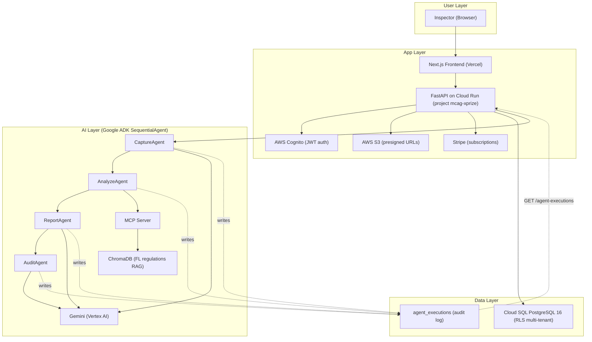

# InspectIQ — AI-Operated Home Inspection SaaS

> Production SaaS for licensed Florida home inspectors, built and operated end to end by a solo founder.
> MCAG Technologies LLC · Build with Gemini XPRIZE submission


[](https://vercel.com)

---

## What is InspectIQ?

InspectIQ replaces paper forms and legacy software for licensed Florida home inspectors, covering the full inspection workflow end to end:

1. **Schedule** — create an inspection with property details, inspection types, and fees
2. **Capture in the field** — document findings, component conditions, and photos from a mobile phone
3. **Generate report** — professional, tenant-branded PDF delivered on demand
4. **Deliver** — mark the inspection as delivered; the report is write-locked

InspectIQ is not a hackathon prototype. It is a production system with two paying customers, operated commercially by a solo founder (MCAG Technologies LLC). An AI agent layer handles business operations — support, onboarding, billing communications, and marketing — alongside the core inspection product, with every agent action recorded to an auditable execution log.

---

## Pre-existing work disclosure

Per the hackathon rules ("You may reuse pre-existing templates, 
frameworks, boilerplates, or code, but you must clearly explain how 
your project utilizes any pre-existing work"), this repository was 
initialized from code developed prior to and during other hackathon 
efforts: the InspectIQ application core (FastAPI backend, Next.js 
frontend, multi-tenant PostgreSQL schema) and the InspectIQ agent 
pipeline (Google ADK, Vertex AI). The imported state is tagged 
`pre-existing-baseline`. Everything after that tag — the AI 
business-operations layer (support, onboarding, billing 
communications, and marketing agents with a unified agent execution 
log), the Google Cloud production deployment (Cloud Run, Cloud SQL, 
Secret Manager), Stripe billing integration, and the live business 
operation itself (real customers, real revenue) — was created during 
the Build with Gemini XPRIZE submission period. The diff between 
`pre-existing-baseline` and `HEAD` constitutes the work performed 
during the window.

---

## Stack

| Layer | Technology |
|---|---|
| **Frontend** | Next.js 14 (App Router) · TypeScript · Tailwind · deployed on Vercel |
| **Backend** | FastAPI · SQLAlchemy 2.0 async · Python 3.12 · Google Cloud Run (project `mcag-xprize`, `us-central1`) |
| **Database** | Cloud SQL for PostgreSQL 16 · Row-Level Security multi-tenancy |
| **Secrets** | Google Secret Manager |
| **Container Registry** | Google Artifact Registry |
| **AI / Agents** | Vertex AI (Gemini) · Google Agent Development Kit (ADK) for orchestration |
| **Auth** | AWS Cognito (OIDC) |
| **Media Storage** | AWS S3 · presigned URLs (SigV4) |
| **Billing** | Stripe subscriptions |
| **PDF Generation** | WeasyPrint · Jinja2 templates |

---

## Architecture

### Multi-tenant RLS

Every table has Row Level Security enforced at the database layer. Tenant context flows from the JWT through a FastAPI dependency into every SQL query via `SET LOCAL app.current_tenant_id`. No application-level filtering — if the RLS policy is missing, the query returns nothing, not the wrong tenant's data.

### Agent Execution Log

Every agent operation — report generation, agreement generation, and the business-operations agents (support, onboarding, billing communications, marketing) — is recorded to an auditable `agent_executions` table: trigger type/ref, tenant, input/output summaries, decision, model, token usage, latency, and status. Logging runs on its own session, isolated from the transaction it observes, and is never allowed to break the operation it logs — a persistence failure is caught and swallowed with a warning. See `app/modules/agent_log/`.

### Photo Pipeline

```
Inspector phone → presigned PUT URL → S3
                                        ↓
                            Cloud SQL (key + view URL)
                                        ↓
                            WeasyPrint PDF (presigned GET, 24h)
```

### Inspection FSM

```
DRAFT → IN_FIELD → PENDING_REVIEW → PUBLISHED → DELIVERED
```

Write-locked at PUBLISHED and DELIVERED. Amendments require a new revision.

---

## Solution Architecture



Every stage of the agent pipeline (Capture, Analyze, Report, Audit) writes a row to the `agent_executions` audit log — trigger, tenant, input/output summaries, decision, model, tokens, latency, status — regardless of whether it succeeds or fails. The log is queryable via `GET /agent-executions` and `GET /agent-executions/stats`.

A full architecture diagram is available at `agent-pipeline/inspectiq_architecture_finalversion.svg`.

---

## Structure

```
apps/
  api/     → FastAPI backend
             modules: inspections, findings, observations, reports,
             agreements, properties, tenants, inspectors, media,
             agent_log
  web/     → Next.js 14 frontend (App Router, Server + Client Components)
docs/adr/  → Architecture decision records
docker-compose.yml → local PostgreSQL 16 for development
```

---

## Key Engineering Decisions

- **RLS over application-level filtering** — tenant isolation enforced at the database, not the ORM
- **Auditable agent execution log** — every agent action (report/agreement generation, business-ops agents) is logged with model, tokens, latency, and outcome, decoupled so a logging failure can never break the operation it observes
- **Presigned PUT URLs** — S3 uploads bypass the backend entirely; bandwidth and latency stay low in the field
- **WeasyPrint for PDF** — server-side HTML to PDF with tenant branding; no headless Chrome dependency
- **Modular monolith** — single FastAPI app with module boundaries; no microservices until scale requires it

---

## Business

| | |
|---|---|
| **Company** | MCAG Technologies LLC · Florida |
| **Product** | InspectIQ — SaaS for licensed Florida home inspectors |
| **Customers** | Two paying customers |
| **Operation** | Built and operated by a solo founder, with an AI agent layer handling support, onboarding, billing communications, and marketing |

---

## Local Development

```bash
# Backend
cd apps/api
pip install -r requirements.txt
uvicorn app.main:app --reload

# Frontend
cd apps/web
npm install
npm run dev
```

`docker-compose.yml` provides a local PostgreSQL 16 instance — no cloud credentials are required to run the app locally. AWS credentials are only needed if you're exercising the S3 upload or Cognito auth integrations directly; GCP credentials are only needed for Vertex AI / Secret Manager integrations. See `app/config.py` for the full list of environment variables.

---

Built for the Build with Gemini XPRIZE · MCAG Technologies LLC · August 2026
